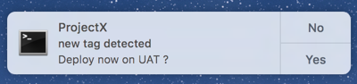

# CLI Pomodoro

CLI Pomodoro is a command line that uses the Pomodoro technique. This is a time management method (By Francesso Cirillo). It consists of dividing the working time into intervals (+/- 25 min of work and 5-10 min of breaks) with a timer.

## Installation :

1. Install the package : timer & terminal-notifier
2. Move the code on the mac.zshrc/linux.zshrc into your jfile *.zshrc

## Timer :

<p align="center">
	
  <font size="1">https://github.com/caarlos0/timer</font>
</p>

Usage :

```sh
$ timer <duration>
$ timer -n <name> <duration>
```
<font size="1">*`<durée>` remplace par un temps valides :  `<durée>` + "ns", "us" (ou "µs"), "ms", "s"(Default) , "m", "h".</font>

## Timer-notifier :

Usage :

```sh
$ terminal-notifier -[message|group|list] [VALUE|ID|ID] [options]
```

<details>
<summary>Options</summary>

At a minimum, you must specify either the `-message` , the `-remove`, or the
`-list` option.

-------------------------------------------------------------------------------

`-message VALUE`  **[required]**

The message body of the notification.

If you pipe data into terminal-notifier, you can omit this option,
and the piped data will become the message body instead.

-------------------------------------------------------------------------------

`-title VALUE`

The title of the notification. This defaults to ‘Terminal’.

-------------------------------------------------------------------------------

`-subtitle VALUE`

The subtitle of the notification.

-------------------------------------------------------------------------------

`-sound NAME`

Play the `NAME` sound when the notification appears.
Sound names are listed in `/System/Library/Sounds`.

Use the special `NAME` “default” for the default notification sound.

-------------------------------------------------------------------------------

`-group ID`

Specifies the notification’s ‘group’. For any ‘group’, only _one_
notification will ever be shown, replacing previously posted notifications.

A notification can be explicitly removed with the `-remove` option (see
below).

Example group IDs:

* The sender’s name (to scope the notifications by tool).
* The sender’s process ID (to scope the notifications by a unique process).
* The current working directory (to scope notifications by project).

-------------------------------------------------------------------------------

`-remove ID`  **[required]**

Remove a previous notification from the `ID` ‘group’, if one exists.

Use the special `ID` “ALL” to remove all messages.

-------------------------------------------------------------------------------

`-list ID` **[required]**

Lists details about the specified ‘group’ `ID`.

Use the special `ID` “ALL” to list details about all currently active messages.

The output of this command is tab-separated, which makes it easy to parse.

-------------------------------------------------------------------------------

`-activate ID`

Activate the application specified by `ID` when the user clicks the
notification.

You can find the bundle identifier (`CFBundleIdentifier`) of an application in its `Info.plist` file
_inside_ the application bundle.

Examples application IDs are:

* `com.apple.Terminal` to activate Terminal.app
* `com.apple.Safari` to activate Safari.app

-------------------------------------------------------------------------------

`-sender ID`

Fakes the sender application of the notification. This uses the specified
application’s icon, and will launch it when the notification is clicked.

Using this option fakes the sender application, so that the notification system
will launch that application when the notification is clicked. Because of this
it is important to note that you cannot combine this with options like
`-execute` and `-activate` which depend on the sender of the notification to be
‘terminal-notifier’ to perform its work.

For information on the `ID`, see the `-activate` option.

-------------------------------------------------------------------------------

`-appIcon PATH`

Specify an image `PATH` to display instead of the application icon.

**WARNING: This option is subject to change, since it relies on a private method.**

-------------------------------------------------------------------------------

`-contentImage PATH`

Specify an image `PATH` to attach inside of the notification.

**WARNING: This option is subject to change since it relies on a private method.**

-------------------------------------------------------------------------------

`-open URL`

Open `URL` when the user clicks the notification. This can be a web or file URL,
or any custom URL scheme.

-------------------------------------------------------------------------------

`-execute COMMAND`

Run the shell command `COMMAND` when the user clicks the notification.

-------------------------------------------------------------------------------

`-ignoreDnD`

Ignore Do Not Disturb settings and unconditionally show the notification.

**WARNING: This option is subject to change since it relies on a private method.**

</details>

### Example Uses

Display piped data with a sound:
```
$ echo 'Piped Message Data!' | terminal-notifier -sound default
```


Use a custom icon:
```
$ terminal-notifier -title ProjectX -subtitle "new tag detected" -message "Finished" -appIcon http://vjeantet.fr/images/logo.png
```



Open an URL when the notification is clicked:
```
$ terminal-notifier -title '💰' -message 'Check your Apple stock!' -open 'http://finance.yahoo.com/q?s=AAPL'
```


Open an app when the notification is clicked:
```
$ terminal-notifier -group 'address-book-sync' -title 'Address Book Sync' -subtitle 'Finished' -message 'Imported 42 contacts.' -activate 'com.apple.AddressBook'
```


## Sources :

- [bashbunni](https://www.youtube.com/watch?v=GfQjJBtO-8Y)
	- [Timer](https://github.com/caarlos0/timer)
	- [Terminal-notifier](https://github.com/julienXX/terminal-notifier)
- [Open-pomodoro](https://github.com/open-pomodoro/openpomodoro-cli)
